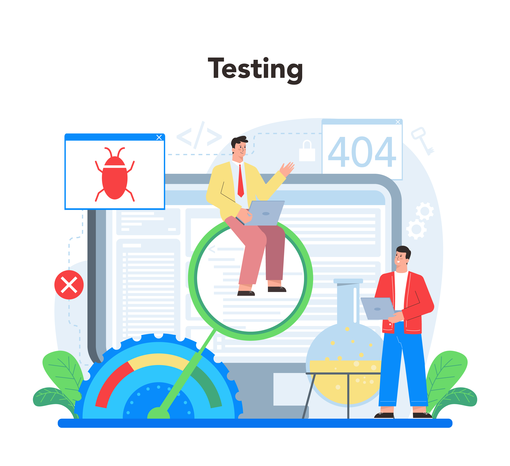

<h1 align="center">📄   Quality Assurance</h1>

---

## 📚 Repositório QA
> Esse repositório serve para compartilhar alguns padrões de escrita de Casos de Testes, BUGs, e estruturar uma Suíte de Testes, também compartilhar um pouco de conhecimento no que apliquei em alguns projetos, e para ajudar QAs a compartilhar exemplo de portfóios no seu github.

---

<strong>Estrutura do Repositório 💼</strong>

Como padronizar Bugs

Como organizar Casos de Testes utilizando escrita de testes BDD
