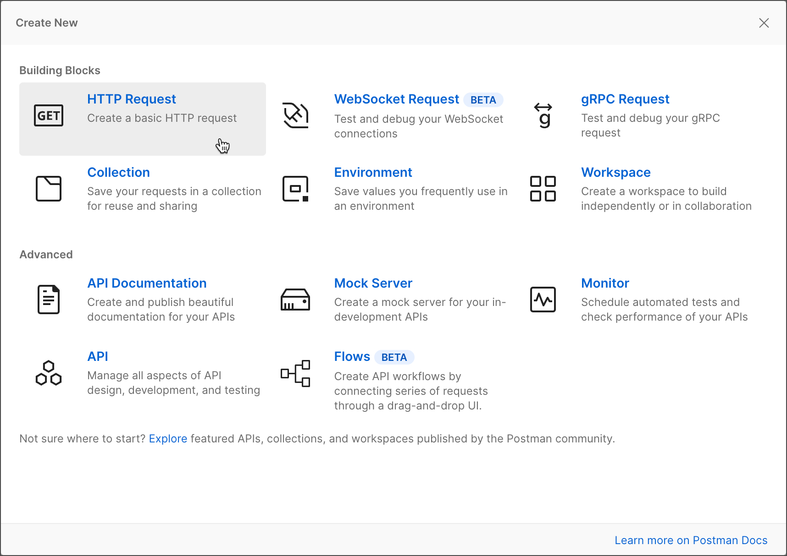

## 📚 Testes em API
> Realizando testes em API. O exemplo prático vai ser utilizado a ferramenta Postman
com a collection [Buscar posts - pode ser baixada aqui](https://jsonplaceholder.typicode.com/) e os Testes com o framework do JavaScript [Mocha](https://mochajs.org/).

Antes de realizarmos os testes, precisamos selecionar uma Collection, podemos seguinte este 
[tutorial](https://learning.postman.com/docs/getting-started/creating-the-first-collection/) do próprio Postman (ferramenta utilizada).

---

### Escrevendo testes em API
> Todo teste vai depender do seu contexto, porém aqui vamos utilizar alguns testes básicos
exemplo "O retorno do status request deve ser 200".

~~~javascript
// Verifica se o status da response é 200
pm.test("Successful POST request", function () {
    pm.expect(pm.response.code).to.be.oneOf([201, 202]);
});

pm.test("Status code is 200", function () {
    pm.response.to.have.status(200);
});

// Valida se o tempo de resposta é 200ms
pm.test("Response time is less than 200ms", function () {
    pm.expect(pm.response.responseTime).to.be.below(200);
});

//Valida se tras todos os 100 posts cadastrados
pm.test("Deve retornar 100 posts", function () {
    pm.response.length == 100;
});

~~~

 Podemos ler mais sobre escrita de testes [Aqui](https://learning.postman.com/docs/writing-scripts/test-scripts/)

<strong>OBS:</strong> Esse documento está em desenvolvimento com mais detalhes sobre passo a passo e testes práticos;